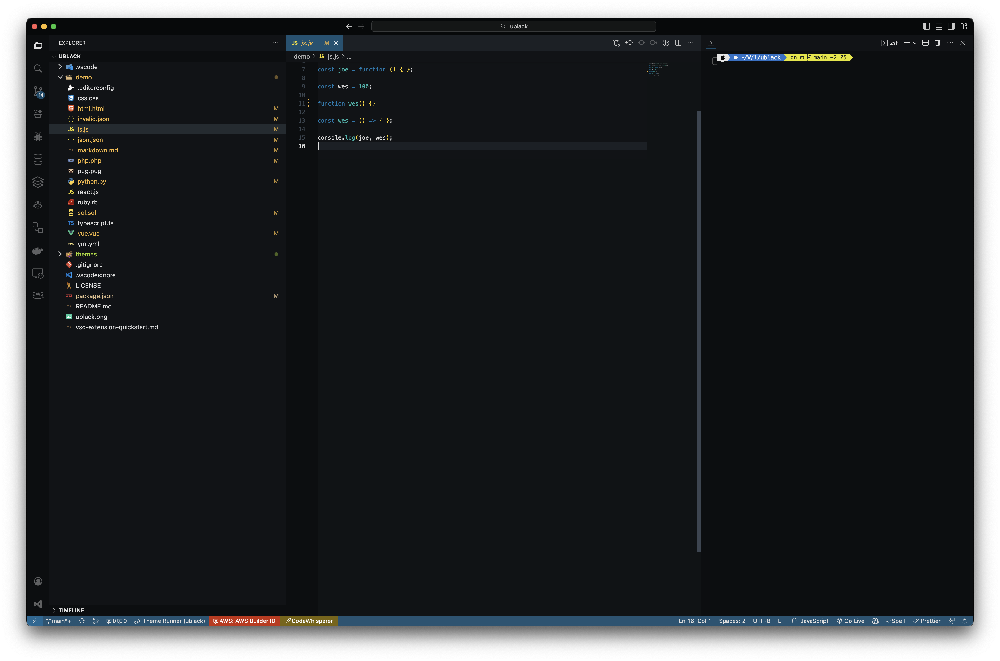

# UBlack Theme for VSCode

  

# Installation
## Easy Installation
To install the extension, just use the extensions tab within VS Code and search for 'UBlack'.

## Manual Installation
Clone the repository into `~/.vscode/extensions` and restart the editor.

## Credits
inspired based on Zamerick on black ocean theme.
